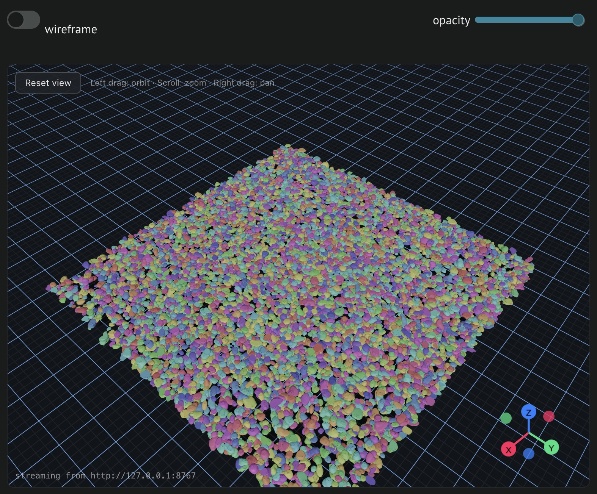

# polyplot

`Three Fiber`–based [anywidget](https://anywidget.dev/) for **2.5D** polygons: preprocess stacked 2D outlines (per `cell_id` and `ZIndex`), build triangulated meshes, export spatial GLB tiles, and view them in the browser with a local tile server and WebGL widget.



**Documentation (Zensical):** [ckmah.github.io/polyplot](https://ckmah.github.io/polyplot/)

## Requirements

- Python 3.12+
- [uv](https://docs.astral.sh/uv/) recommended (see `pyproject.toml` for dependencies)

## Install

From the repository root:

```bash
uv sync
```

## Quick start (marimo)

```bash
uv run marimo edit quickstart.py
```

[](https://molab.marimo.io/github/ckmah/polyplot/blob/main/quickstart.py)

## Usage

```python
import polyplot as po

tiles_info = po.meshify(gdf)  # default cache: ./.polyplot/<hash>/
po.plot(gdf)  # meshifies from cache if needed; wireframe / opacity / BG in the viewer UI
```

- **`meshify`**: preprocess a GeoDataFrame (`cell_id`, `ZIndex`, `geometry`), write `tiles/` and `tiles.json` under `.polyplot/<content hash>/` by default (override with `out_dir=...`). Use `smooth=False` for no Taubin smoothing, `use_cache=False` to force a rebuild.
- **`plot`**: calls `meshify` when needed, starts or reuses a local tile server, and returns a marimo `anywidget` viewer. Wireframe, opacity, and background are adjusted in the widget toolbar, not via Python.

## Full demo

The longer example is `notebook.py` (a marimo app):

```bash
uv run marimo edit notebook.py
```

## Sample data

The repository tracks **`sample_data/liver_crop_sample.parquet`**, a small subset (~50 cells) for CI and quick starts. A full `liver_crop.parquet` and other large exports can live in `sample_data/` locally; they are gitignored. To regenerate the subset from a local full file:

```bash
uv run python scripts/make_liver_subset.py
```

## Development

The Python package lives in the `polyplot/` directory. Optional: install [gltfpack](https://github.com/zeux/meshopt) on your PATH for smaller GLB files (compression is enabled inside `meshify`).

## Repository

[github.com/ckmah/polyplot](https://github.com/ckmah/polyplot)

To publish pre-rendered molab sessions, run from the repo root: `uvx marimo export session quickstart.py` (and similarly for `notebook.py` if desired).
